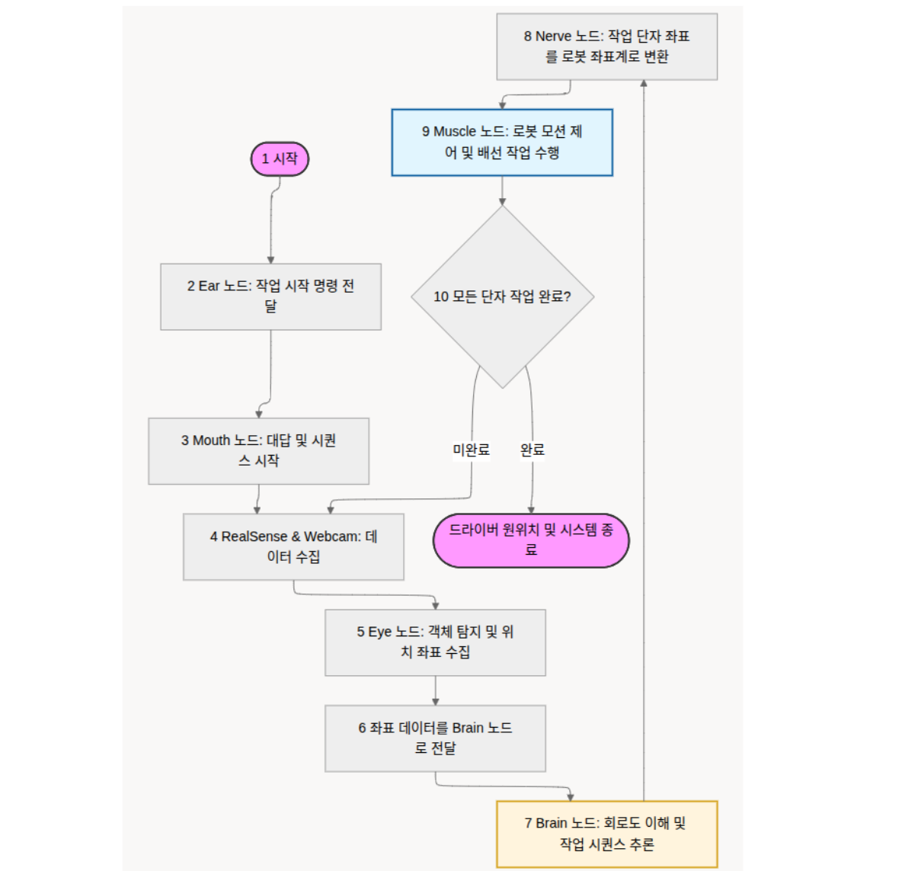
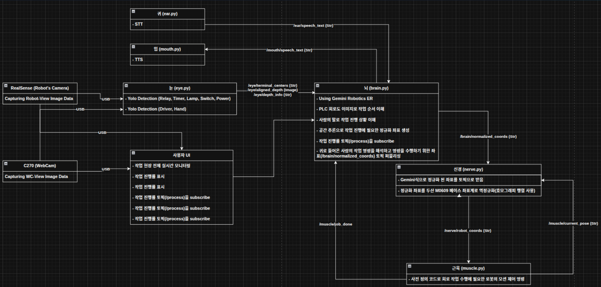
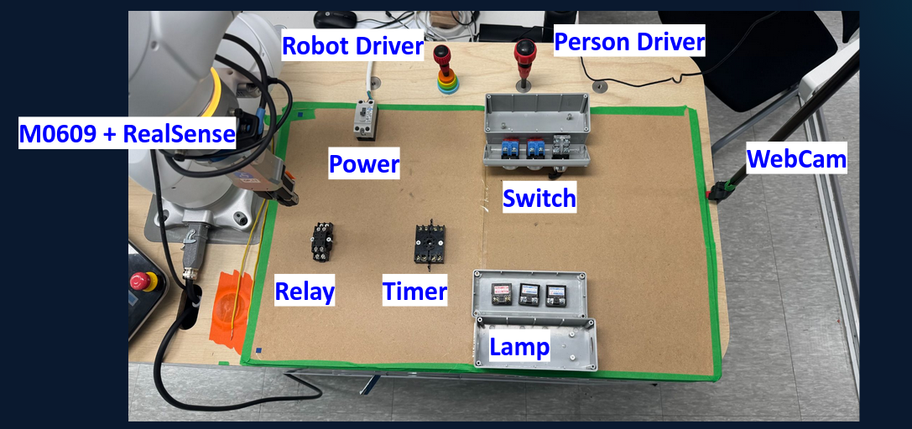
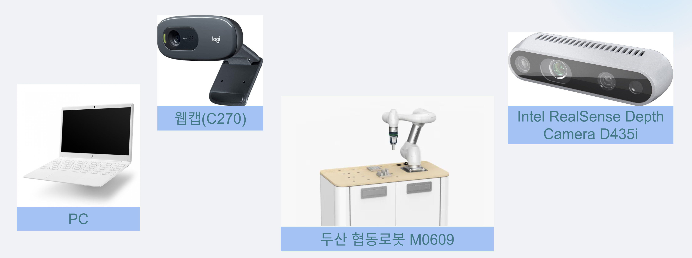
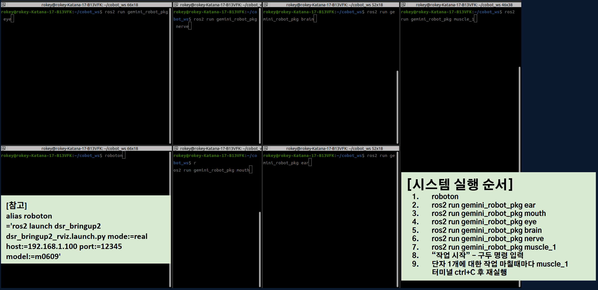

# 🤖 Doosan Robot AI-driven Assembly & Monitoring System

두산 M0609 협동 로봇과 **Gemini Robotics ER**를 결합하여 PLC 회로도 결선 공정을 사람 작업자와 실시간으로 소통하며 협업하는 시스템입니다. YOLO 기반의 객체 탐지와 Gemini Robotics ER의 공간 추론을 통해 PLC 회로도 작업 우선순위를 결정하며, 작업자와의 음성 상호작용(STT/TTS)을 통해 안전하고 정밀한 자동화를 구현합니다.

## 🛠️ Tech Stack

* **Robot Control**: Python, ROS 2 Humble, Doosan Robotics Library (`DR_init`, `DSR_ROBOT2`)
* **AI & Vision**: **Gemini Robotics ER** (로보틱스 특화 공간 추론), **YOLOv8/v26** (부품과 드라이버 탐지), OpenCV
* **HRI (Interaction)**: STT, gTTS (TTS)
* **Coordinate System**: **Hand-Eye Calibration**
* **Hardware**: Doosan M0609, Intel RealSense D435, OnRobot RG2 Gripper, Logitec C270

---

## 📂 Project Structure

### 1. Flow Chart


### 2. System Architecture


### 3. Code Architecture
```text
.
.
├── README.md
├── data
│   ├── calibration                                     # Calibration에 필요한 변환행렬들
│   │   ├── T_cam2base.npy 
│   │   ├── T_gripper2camera.npy
│   │   ├── camera_matrix.npy
│   │   ├── dist_coeffs.npy
│   │   └── matrix.json
│   └── circuits                                        # brain 노드에 넣어주는 회로도 이미지들
│       ├── plc_circuit.png
│       ├── relay_circuit.jpg
│       └── timer_circuit.jpg
├── gemini_robot_pkg
│   ├── app.py                                          # UI 데모 파일1 (가상 전선 배선)
│   ├── app_1.py                                        # UI 데모 파일 2 (로그인 화면)
│   ├── brain.py                                        # Brain 노드 소스 1 (사람이 하는 일을 먼저 수행하도록 안내)
│   ├── brain_connected.py                              # Brain 노드 소스 2 (로봇이 하는 일을 먼저 수행)
│   ├── calib_node.py                                   # Nerve 노드에서 사용 되는 변환 행렬을 만든 코드
│   ├── ear.py                                          # STT 수행 노드
│   ├── eye.py                                          # YOLO Detection 수행하는 노드
│   ├── eye_ui.py                                       # 각종 로그 및 실시간 모니터링 수행용 UI (최종 발표 ppt 자료에 수록)
│   ├── mouth.py                                        # TTS 수행 노드
│   ├── muscle_1.py                                     # 로봇 모션 제어 노드
│   ├── nerve.py                                        # 로봇 좌표로 변환하는 노드
│   └── onrobot.py                                      # 그리퍼 기능 import 용 노드
├── package.xml
├── resource
│   ├── gemini_robot_pkg
│   ├── plc_circuit.png                                 # 전체 회로도 이미지
│   ├── relay_circuit.jpg                               # relay 부품 내부 단자 회로도 이미지
│   └── timer_circuit.jpg                               # timer 부품 내부 단자 회로도 이미지
├── setup.cfg
├── setup.py
├── static                                              # UI 구동에 필요한 정적 리소스
│   └── style.css
├── templates                                           # UI 구동에 필요한 html 템플릿
│   ├── index.html
│   ├── layout.html
│   └── login.html                                      # 로그인 기능용 템플릿
└── trained_models                                      # 시스템 구동에 필요한 YOLO 모델들
    ├── best_lamp_v_260225.pt                           # lamp det용 
    ├── best_power.pt                                   # power det용 
    ├── best_relay.pt                                   # relay det용 
    ├── best_switch.pt                                  # switch det용 
    ├── best_timer_v_260225.pt                          # timer det용 
    └── webcam_driver_v4.pt                             # driver & hand det용


```

### 🏗️ 주요 디렉토리 상세 설명

| 폴더명 | 설명 |
| --- | --- |
| **`gemini_robot_pkg`** | 로봇 전체 시스템 구동에 필요한 전체 노드들의 소스가 위치한 폴더입니다. |
| **`trained_models`** | eye(눈) 노드 실행에 필요한 YOLO 객체 탐지 모델들이 위치한 폴더입니다. |
| **`data/circuits`** | brain(뇌) 노드의 공간 추론에 필요한 회로도 이미지들이 위치한 폴더입니다. |

---

## 📊 System Representing Images

### 1. System Map


---

## 🌟 Key Features

### 1. AI-Driven Decision Making (Brain)

* **YOLO Detection**: 회로도 부품 5종(Timer, Relay, Lamp, Switch, Power)을 실시간으로 탐지합니다.
* **Spatial Reasoning**: Gemini Robotics ER이 탐지된 좌표를 기반으로 "지금 조여야 할 나사"의 우선순위를 스스로 판단합니다.

### 2. Human-in-the-Loop Interaction (Mouth & Ear)

* **Voice Approval**: 로봇이 독단적으로 움직이지 않고, 작업자에게 음성으로 수행 여부를 묻습니다 (예: "Relay 4번 작업을 수행할까요?").
* **Dynamic Command**: 작업자가 승인하거나("응 작업해"), 명령을 변경할 수 있습니다("아니, 그거 말고 Relay 6번 해").

### 3. Precision Coordinate Mapping (Nerve)

* **Denormalization**: Gemini의 정규화 좌표($1\sim1000$)를 실제 픽셀 좌표로 복원합니다.
* **Matrix Transformation**: $4 \times 4$ Hand-Eye 캘리브레이션 행렬을 적용하여 카메라 좌표를 로봇의 베이스 좌표계($mm$)로 정밀 변환합니다.

### 4. Adaptive Motion Control (Muscle)

* **Task-Specific Motion**: 조임(Unscrew), 픽업(Pick), 이동(Move) 등 작업 종류에 맞는 최적화된 궤적을 생성합니다.

---

## 🏗️ 6-Stage Process Flow

시스템은 인간의 신경계 구조를 모사하여 총 6단계로 동작합니다.

1. **Mouth**: 작업자에게 "OO번 작업을 수행할까요?"라고 음성으로 질의합니다.
2. **Ear**: 작업자의 음성(STT)을 수신하여 Brain으로 전달합니다.
3. **Eye**: 로봇의 배선 작업 수행에 필요한 YOLO Detection 좌표 수집을 수행합니다.
4. **Brain**: YOLO 탐지 결과를 기반으로 작업 순서를 결정하고, 로봇이 mouth를 통해 할 말에 대한 text를 생성합니다. 또 최종 승인된 타겟의 정규화 좌표를 Nerve로, 작업 종류를 Muscle로 전송합니다.
5. **Nerve**: 정규화 좌표를 로봇 베이스 좌표계($X, Y, Z$)로 물리적 변환을 수행합니다.
6. **Muscle**: 변환된 좌표와 작업 종류를 조합하여 로봇 팔과 그리퍼를 실제 제어합니다.

---

## 🚀 Installation & Running

### 1. Requirements

* **OS** : Ubuntu 22.04 LTS, ROS 2 Humble
* **Doosan Robotics ROS 2 Driver**
* **Python Libraries** : `ultralytics`, `scipy`, `google-generativeai`, `speech_recognition`, `gTTS`
* **'GEMINI_API_KEY_BRAIN', 'GEMINI_API_KEY_EAR'** : Google AI Studio에서 할당 받은 API Key를 `~/.bashrc`에서 직접 환경변수 설정 필수
* **HardWare Requirements** : 
    

### 2. Execution



---
